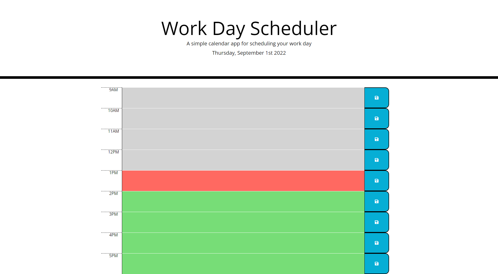

# Calender

This is a simple daily work planner. It is set up for a standard 9-5 workday, just click in the box next to the time you wish to plan and hit the save butoon when you're ready!
The best part is that even if you close the tab, your plans stay put! When you're ready for new plans, just delete the old ones and save the new ones. The hours even change color with the time.
Gray for the past, green for the future, and red to let you know what time it currently is, now go on and get your life together!